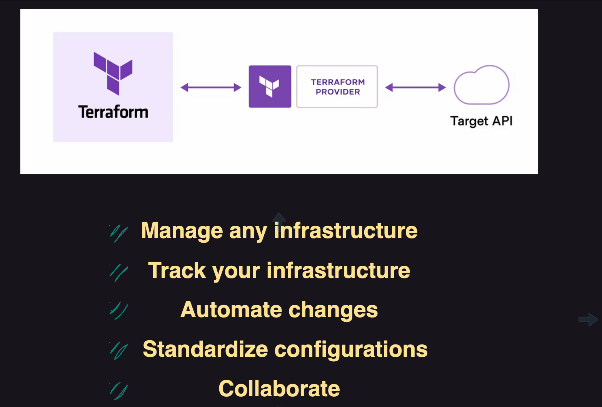
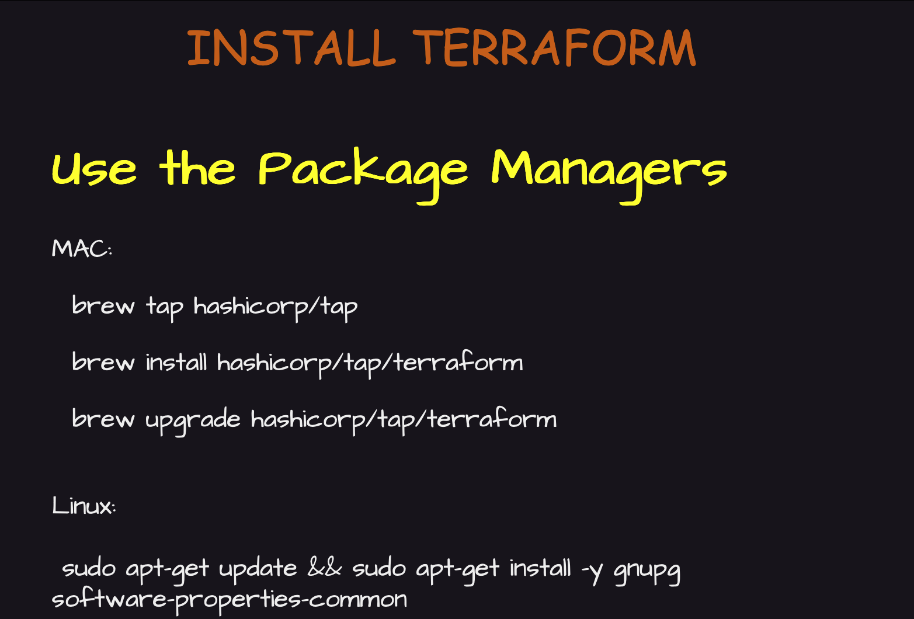
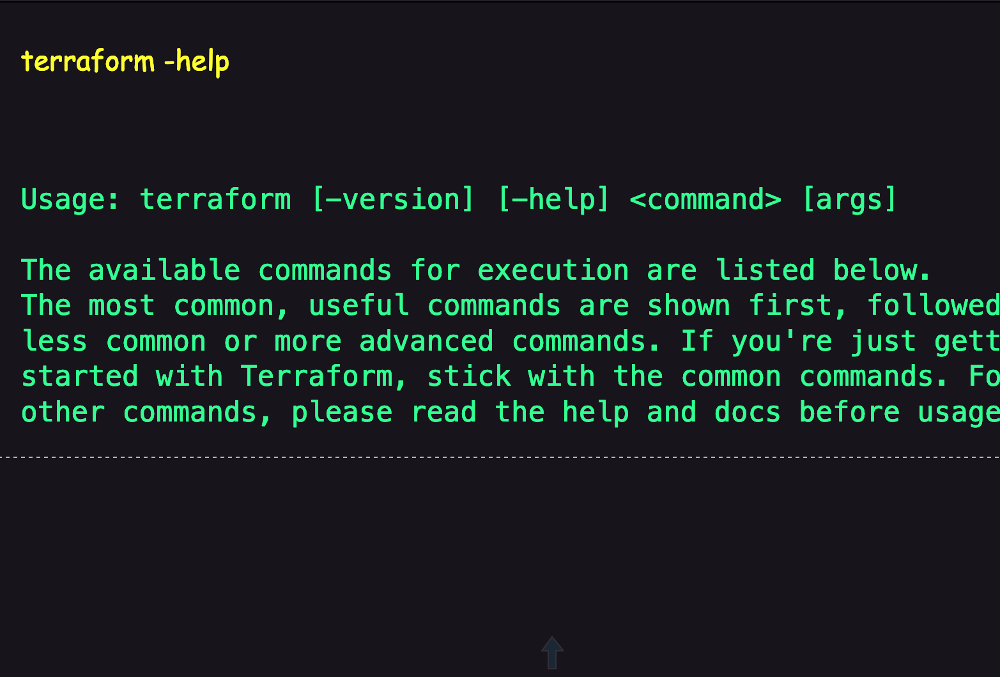
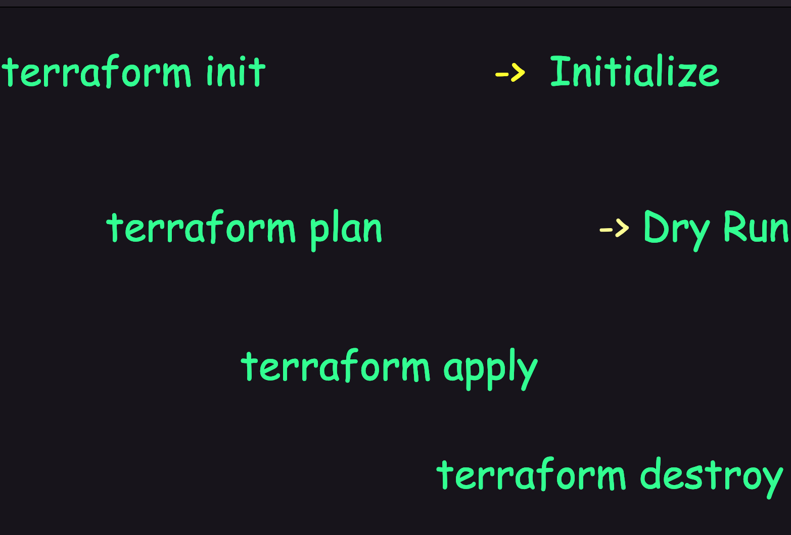
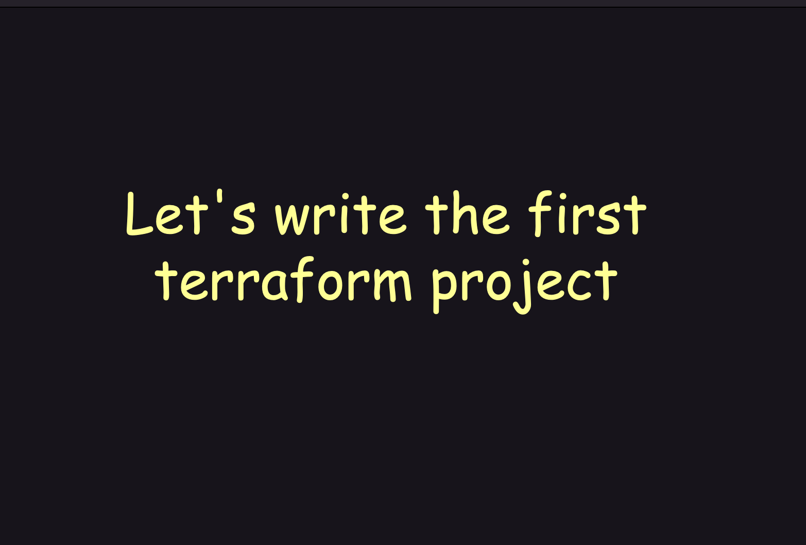
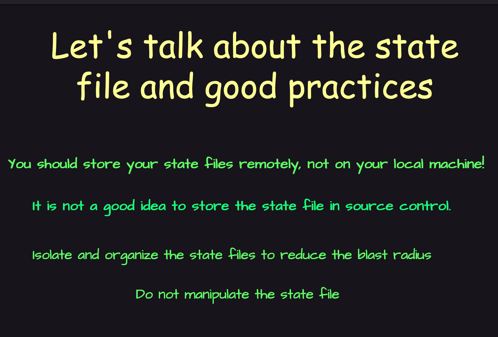
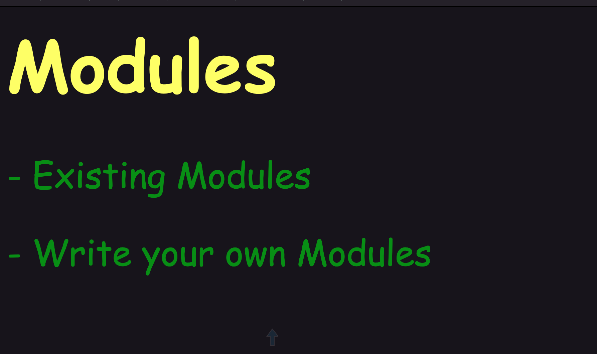
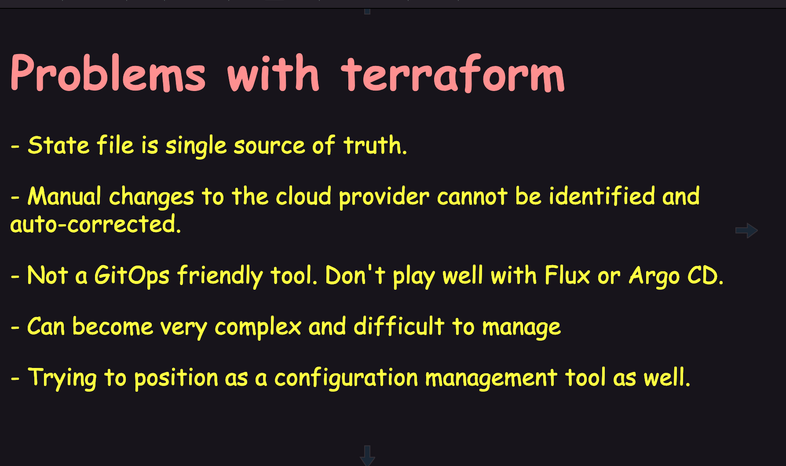
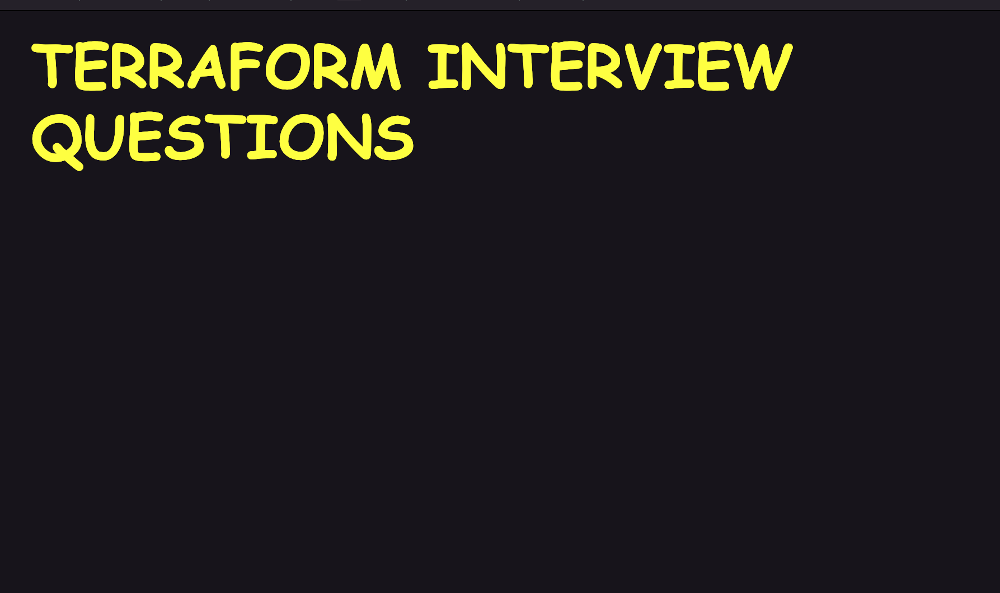

# Terraform Workflow mainly 4 commands:

# 1. terraform init   
                   This command downloads the provider plugins and one version lock file
and will create one (.terraform) hidden directory and (.terraform.lock.hcl) contains 
version.

# 2. terraform plan
                    This command generates an execution plan like blue print whatever 
resources will create.

# 3. terraform apply 
                    This command generates one (terraform.tfstate)file. It contains 
resources data in the form of Json. This command creates the resources in aws cloud.
whatever cloud provider you declared in provider block.

# 4. terraform destroy
                      This command destroy the total resources whatever you created.